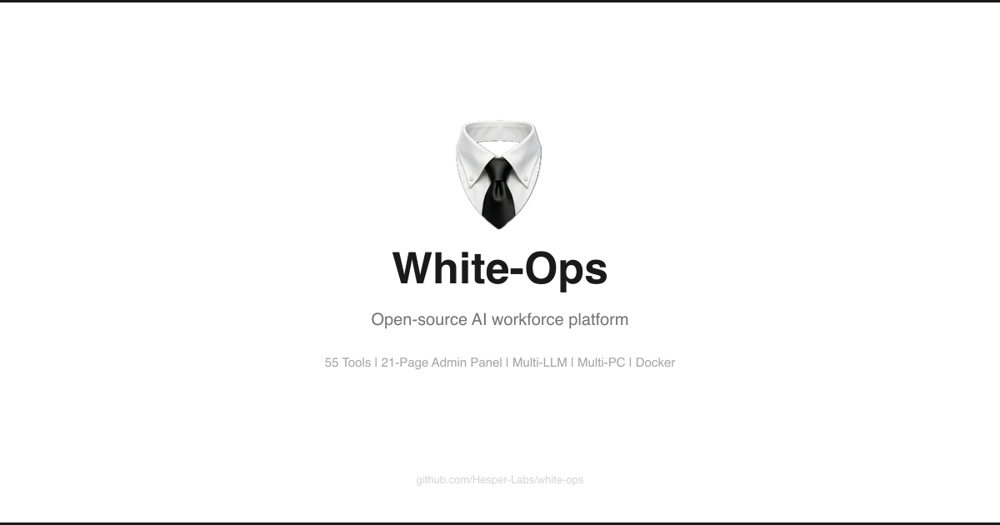

<p align="center">
  
</p>

<p align="center">
  
  
  
  
  
  
  
</p>

---

Enterprise AI workforce platform. Deploy AI agents on multiple PCs that handle professional tasks: email, documents, web research, data analysis, code review, DevOps, cloud ops, and 70+ more. Manage everything from a single admin panel with chat interface, live execution terminal, marketplace, and full RBAC.

## Key Features

| Feature | Description |
|---------|-------------|
| **83+ Tools** | Excel, Word, PDF, browser, email, Slack, GitHub, Jira, Docker, Terraform, AWS, and more |
| **Agent Chat** | ChatGPT-style conversational interface to interact with agents directly |
| **Live Terminal** | Watch agent execution in real-time with tool calls, reasoning, and cost tracking |
| **Code Reviews** | Visual diff viewer with approve/reject workflow for agent-generated code |
| **Marketplace** | Browse and install pre-built agent templates (16 templates across 8 categories) |
| **Autonomy Controls** | 4-level safety tiers: Autonomous, Cautious, Supervised, Read-Only |
| **Multi-LLM** | Claude, GPT, Gemini, Ollama (local) via unified interface |
| **Multi-PC Workers** | Distribute agents across multiple machines, managed from one panel |
| **37-Page Admin Panel** | Dashboard, agents, tasks, workflows, chat, terminal, settings, security, and more |
| **Setup Wizard** | 7-step onboarding with system check, worker deployment guide, and LLM setup |
| **Workflow Builder** | Visual DAG-based automation with conditions and parallel execution |
| **Cost Management** | Per-agent, per-provider cost tracking with budget alerts and forecasting |
| **Secrets Vault** | AES-256 encrypted secret storage with rotation, expiry tracking, and audit logging |
| **Circuit Breakers** | Distributed fault tolerance for external services (Redis-backed) |
| **Approval Workflows** | Configurable approval chains for sensitive operations |
| **Notifications** | Multi-channel delivery: Slack, email, Telegram, Discord, webhook |
| **10-Tab Settings** | General, LLM, Email, Storage, Security, Notifications, Integrations, Backups, Feature Flags, Danger Zone |
| **Security** | JWT + refresh tokens, MFA/TOTP, account lockout, RBAC (40+ permissions), rate limiting, API key bcrypt hashing |
| **CI/CD** | GitHub Actions: lint, test, security scan, Docker build/push to GHCR |
| **Kubernetes** | Helm charts with Deployments, StatefulSets, HPA, PDB, NetworkPolicy, Ingress (TLS) |
| **Dark Mode** | Full dark/light/system theme support across all pages |
| **Accessibility** | ARIA roles, keyboard navigation, screen reader support |

## Architecture

```
React SPA (37 pages) --> FastAPI Server (29 API modules) --> PostgreSQL + Redis + MinIO
                          |  WebSocket                        |  Redis Pub/Sub
                        Celery Workers                     Worker Nodes (83+ tools)
                        (celery-worker, celery-beat)
```

**12 Docker services**: PostgreSQL, Redis, MinIO, FastAPI server, Agent worker, Celery worker, Celery beat, Nginx frontend, Mail server, Prometheus, Grafana, Redis/Postgres exporters

## Quick Start

### Prerequisites

- Docker 24+ and Docker Compose v2
- 4 CPU cores, 8 GB RAM minimum
- An LLM API key (Anthropic, OpenAI, Google, or local Ollama)

### Setup

```bash
# Clone
git clone https://github.com/Hesper-Labs/white-ops.git
cd white-ops

# Configure
cp .env.example .env
# Edit .env - set these REQUIRED values:
#   SECRET_KEY          (>= 32 chars, random)
#   JWT_SECRET_KEY      (>= 32 chars, different from SECRET_KEY)
#   POSTGRES_PASSWORD   (strong password)
#   REDIS_PASSWORD      (strong password)
#   VAULT_MASTER_KEY    (>= 32 chars, for secrets encryption)
#   ADMIN_PASSWORD      (strong password)
#   At least one LLM API key (ANTHROPIC_API_KEY, OPENAI_API_KEY, or GOOGLE_API_KEY)

# Validate configuration
make check

# Start all services
docker compose up -d

# Open admin panel
open http://localhost:3000
```

The Setup Wizard will guide you through initial configuration on first visit.

### Development

```bash
make dev          # Start with hot reload
make test         # Run all tests (backend + worker)
make lint         # Lint Python + TypeScript
make build        # Build Docker images
make logs         # Tail service logs
```

### Testing

```bash
# Backend
cd server && python -m pytest tests/ -v

# Worker security tests
cd worker && python -m pytest tests/ -v

# Frontend
cd web && npm test

# With coverage
cd web && npm run test:coverage
```

### Monitoring (optional)

```bash
# Start with Prometheus + Grafana + exporters
docker compose --profile monitoring up -d

# Prometheus: http://localhost:9090
# Grafana:    http://localhost:3001 (set GRAFANA_ADMIN_PASSWORD in .env)
```

## Tool Categories (83+)

| Category | Tools |
|----------|-------|
| **Office** | Excel, Word, PowerPoint, PDF, Forms, Notes |
| **Communication** | Email, Slack, Teams, Discord, SMS, Calendar, Telegram |
| **Research** | Browser, Search, Web Scraper, RSS, Summarizer, Translator |
| **Data** | Analysis, Database, Cleaning, Visualization, Converter |
| **Technical** | Shell, Git, Docker, Claude Code Bridge, Code Execution, API Caller, SSH |
| **DevOps** | Terraform, Kubernetes, CI/CD, Ansible |
| **Cloud** | AWS (EC2/S3/Lambda), Azure, GCP |
| **Business** | CRM, Invoice, Expense Reports, Project Tracker, Time Tracker |
| **Finance** | Bookkeeping, Currency, Tax Calculator |
| **HR** | Payroll, Employee Directory, Leave Manager |
| **Monitoring** | Health Checker, Prometheus, Log Analyzer |
| **Security** | Vulnerability Scanner, Secret Scanner, Port Scanner |
| **Integrations** | GitHub, Jira, Notion, PagerDuty, Sentry, Linear |

## Security

- JWT with refresh token rotation (access: 30min, refresh: 7d)
- MFA/TOTP with backup codes and enrollment flow
- Account lockout after configurable failed attempts
- Password complexity (12+ chars, mixed case, digits, symbols) + history
- API key bcrypt hashing with legacy SHA-256 migration support
- Redis-backed distributed rate limiting (per-IP, per-user, per-endpoint) with in-memory fallback
- AES-256 (Fernet) encrypted secrets vault with rotation, expiry, and audit logging
- RBAC with 40+ granular permissions (admin, operator, viewer)
- Security headers (HSTS, CSP, X-Frame-Options, Referrer-Policy, Permissions-Policy)
- Nginx rate limiting on auth endpoints (5 req/min) and API (30 req/s)
- Request body size limits and input validation
- Non-root Docker containers with multi-stage builds
- Startup config validation: refuses to boot with default secrets in production
- Fail-closed token revocation: denies requests when Redis is unavailable
- Tool sandbox: shell command blocking (regex), code execution resource limits, symlink attack prevention, SQL injection protection, SSRF/DNS resolution checks
- Pre-deployment security check script (`make check`)

See [docs/security.md](docs/security.md) for full details.

## Deployment

### Docker Compose (Production)

```bash
# Validate first
make check

# Deploy
docker compose up -d
```

### Kubernetes (Helm)

```bash
# Create required secrets first
kubectl create secret generic whiteops-postgres-secret --from-literal=password=YOUR_PG_PASSWORD
kubectl create secret generic whiteops-redis-secret --from-literal=password=YOUR_REDIS_PASSWORD
kubectl create secret generic whiteops-minio-secret \
  --from-literal=root-user=whiteops \
  --from-literal=root-password=YOUR_MINIO_PASSWORD

# Deploy
cd deploy/helm
helm install whiteops ./white-ops -f values.yaml
```

Includes: Deployments, StatefulSets, Services, HPA (auto-scaling), PodDisruptionBudgets, NetworkPolicy, Ingress with TLS, ConfigMap, ServiceAccount, resource limits, PVC for data services.

### Adding Remote Workers

```bash
# On each remote machine:
docker compose up worker -d
# Or see Setup Wizard for detailed multi-PC deployment instructions
```

## CI/CD Pipeline

GitHub Actions (`.github/workflows/ci.yml`) runs on push to main/develop and PRs:

1. **lint-frontend** - TypeScript type check
2. **lint-backend** - Ruff lint (server + worker)
3. **security-scan** - npm audit + Trivy filesystem scan
4. **test-backend** - pytest with PostgreSQL + Redis services
5. **test-frontend** - Vitest
6. **build-docker** - Multi-service Docker build and push to GHCR (main branch only)

## Tech Stack

| Layer | Technologies |
|-------|-------------|
| **Backend** | FastAPI, SQLAlchemy 2.0 (async), Alembic, Celery, Redis, MinIO, Pydantic v2 |
| **Worker** | LiteLLM, Playwright, pandas, boto3, openpyxl, python-docx |
| **Frontend** | React 18, TypeScript, Vite, Tailwind CSS, Zustand, TanStack Query, Recharts |
| **Database** | PostgreSQL 16, Redis 7 (AOF + RDB persistence) |
| **Infra** | Docker Compose (12 services), Helm/Kubernetes, Prometheus, Grafana, Nginx |
| **CI/CD** | GitHub Actions (lint, test, security scan, Docker build) |
| **Monitoring** | Prometheus + redis-exporter + postgres-exporter, Grafana dashboards, alert rules |

## Documentation

| Document | Description |
|----------|-------------|
| [Getting Started](docs/getting-started.md) | 5-minute setup and first agent |
| [Architecture](docs/architecture.md) | System topology, data flow, components |
| [Deployment](docs/deployment.md) | Docker Compose, Kubernetes, production checklist |
| [Security](docs/security.md) | Auth, RBAC, vault, sandbox, audit, threat model |
| [API Reference](docs/api-reference.md) | All REST endpoints with examples |
| [Admin Panel](docs/admin-panel.md) | All 37 pages and features |
| [Tools Guide](docs/tools-guide.md) | 83 tools, categories, creating custom tools |
| [Contributing](docs/contributing.md) | Dev setup, code standards, PR process |

## License

Apache License 2.0 - see [LICENSE](LICENSE) for details.
